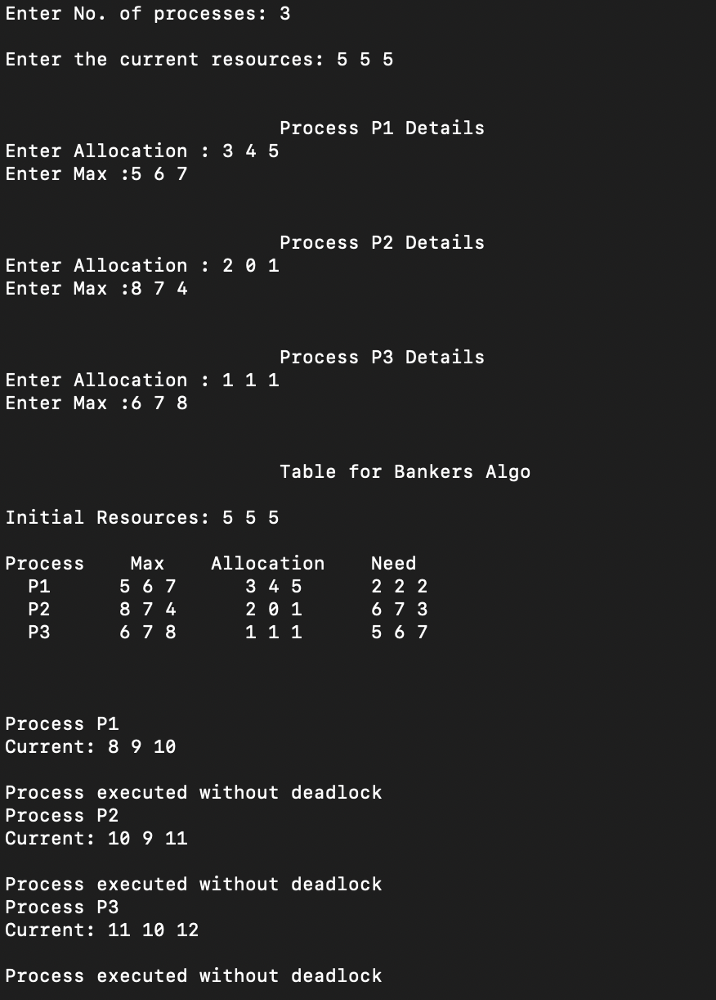

# Banker's-Algorithm

We have made a program using C++ which can be executed for different process to find out if deadlock happens or not. 
User can also try to change constraints like initial resources, allocated or max resources of a process.

## Output

  

